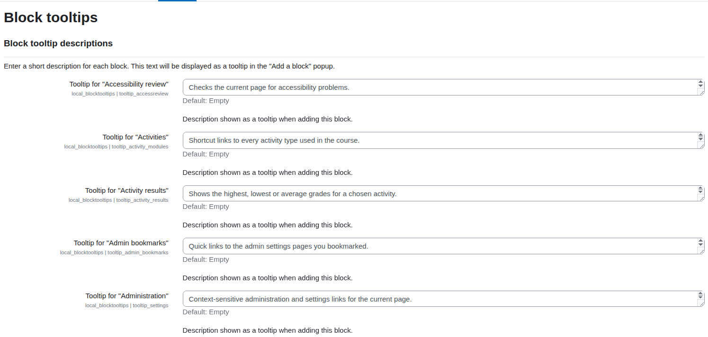
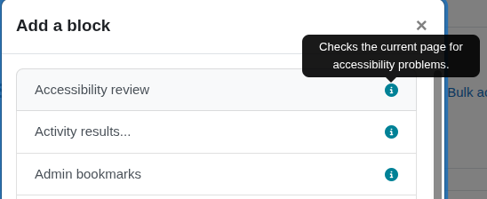
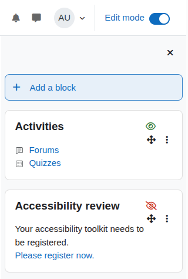

# Block tooltips — User guide (English)

This guide is intended for **course editors** and **administrators**.

## What this plugin does

Block tooltips adds two helpers when you work with blocks in edit mode:

1. **Tooltips** — a small info icon next to each block in the *Add a block* popup,
   showing a short description of what the block does.
2. **Student visibility** — an eye icon on each block in a course, telling you
   whether students currently see that block or not.

Both helpers are only visible to users who are allowed to edit blocks, and only
while **Edit mode** is on. Students never see anything added by this plugin.

---

## For administrators: configuring tooltips

1. Go to **Site administration → Plugins → Local plugins → Block tooltips**.
2. You will see one text area per installed block, sorted alphabetically.
3. Type a short, plain-text description for each block you want to document.
   - Keep it concise — it is shown as a hover tooltip.
   - Leave a field empty to display no tooltip for that block.
4. Click **Save changes**.

---

## For editors: reading tooltips

1. On any page, turn **Edit mode** on (top-right switch).
2. Open the **Add a block** popup.
3. Blocks that have a description show an **ℹ️ info icon**. Hover the mouse over it
   (or focus it with the keyboard) to read the description before adding the block.

---

## For editors: student visibility indicator

1. Open a **course** and turn **Edit mode** on.
2. Each block shows an eye icon in its header/control area:
   - **👁️ Green eye** — the block is *visible* for students.
   - **🚫 Red crossed-out eye** — the block is *hidden* for students.
3. Hover the icon to see the label ("Visible for students" / "Hidden for students").

This indicator is read-only: it does not change anything, it only tells you what a
student would see. It is available in course contexts only.

---

## Frequently asked questions

**Why don't I see any icons?**
Make sure Edit mode is on and that you have permission to edit blocks
(`moodle/block:edit`).

**Why is there no tooltip on a particular block?**
No description has been configured for that block. An administrator can add one in
the plugin settings.

**Does this plugin collect any personal data?**
No. It stores no personal data.
